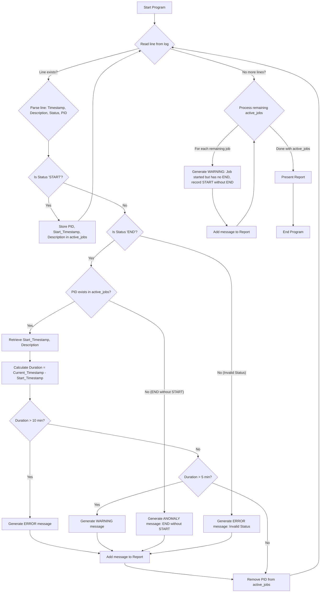

```mermaid
graph TD
    A[Start Program] --> B{Read line from log};
    B -- Line exists? --> C{Parse line: Timestamp, Description, Status, PID};
    C --> D{Is Status 'START'?}
    D -- Yes --> E[Store PID, Start_Timestamp, Description in active_jobs];
    E --> B;
    D -- No --> F{Is Status 'END'?};
    F -- Yes --> G{PID exists in active_jobs?};
    G -- Yes --> H[Retrieve Start_Timestamp, Description];
    H --> I[Calculate Duration = Current_Timestamp - Start_Timestamp];
    I --> J{Duration > 10 min?};
    J -- Yes --> K[Generate ERROR message];
    K --> M[Add message to Report];
    M --> N[Remove PID from active_jobs];
    N --> B;
    J -- No --> O{Duration > 5 min?};
    O -- Yes --> P[Generate WARNING message];
    P --> M;
    O -- No --> N;
    G -- No (END without START) --> Q[Generate ANOMALY message: END without START];
    Q --> M;
    F -- No (Invalid Status) --> R[Generate ERROR message: Invalid Status];
    R --> M;
    B -- No more lines? --> S{Process remaining active_jobs};
    S -- For each remaining job --> T[Generate WARNING: Job started but has no END, record START without END];
    T --> U[Add message to Report];
    U --> S;
    S -- Done with active_jobs --> V[Present Report];
    V --> W[End Program];
```