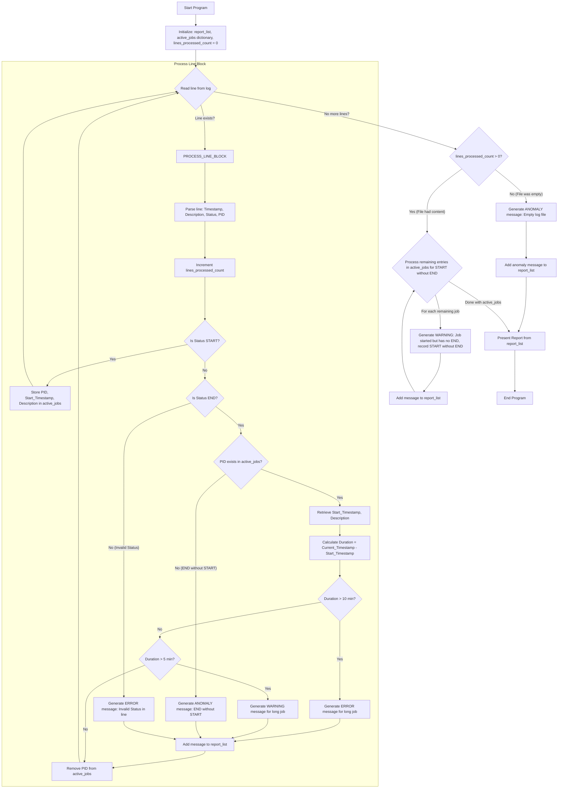

```mermaid
graph TD
    A[Start Program] --> INIT[Initialize: report_list, active_jobs dictionary, lines_processed_count = 0]
    INIT --> B_READ_LOOP_START{Read line from log}

    B_READ_LOOP_START -- Line exists? --> PROCESS_LINE_BLOCK
    
    subgraph Process Line Block
        PROCESS_LINE_BLOCK --> C[Parse line: Timestamp, Description, Status, PID]
        C --> INCREMENT_COUNT[Increment lines_processed_count]
        INCREMENT_COUNT --> D{Is Status START?}
        D -- Yes --> E[Store PID, Start_Timestamp, Description in active_jobs]
        E --> B_READ_LOOP_START
        D -- No --> F{Is Status END?}
        F -- Yes --> G{PID exists in active_jobs?}
        G -- Yes --> H[Retrieve Start_Timestamp, Description]
        H --> I[Calculate Duration = Current_Timestamp - Start_Timestamp]
        I --> J{Duration > 10 min?}
        J -- Yes --> K[Generate ERROR message for long job]
        K --> M[Add message to report_list]
        M --> N[Remove PID from active_jobs]
        N --> B_READ_LOOP_START
        J -- No --> O{Duration > 5 min?}
        O -- Yes --> P[Generate WARNING message for long job]
        P --> M
        O -- No --> N
        G -- No (END without START) --> Q[Generate ANOMALY message: END without START]
        Q --> M
        F -- No (Invalid Status) --> R[Generate ERROR message: Invalid Status in line]
        R --> M
    end

    B_READ_LOOP_START -- No more lines? --> CHECK_IF_ANY_LINES_PROCESSED{lines_processed_count > 0?}

    CHECK_IF_ANY_LINES_PROCESSED -- No (File was empty) --> EMPTY_FILE_MSG[Generate ANOMALY message: Empty log file]
    EMPTY_FILE_MSG --> ADD_EMPTY_FILE_MSG_TO_REPORT[Add anomaly message to report_list]
    ADD_EMPTY_FILE_MSG_TO_REPORT --> V_PRESENT_REPORT[Present Report from report_list]

    CHECK_IF_ANY_LINES_PROCESSED -- Yes (File had content) --> S_PROCESS_UNFINISHED_JOBS{Process remaining entries in active_jobs for START without END}
    S_PROCESS_UNFINISHED_JOBS -- For each remaining job --> T_WARN_UNFINISHED[Generate WARNING: Job started but has no END, record START without END]
    T_WARN_UNFINISHED --> U_ADD_UNFINISHED_TO_REPORT[Add message to report_list]
    U_ADD_UNFINISHED_TO_REPORT --> S_PROCESS_UNFINISHED_JOBS
    S_PROCESS_UNFINISHED_JOBS -- Done with active_jobs --> V_PRESENT_REPORT

    V_PRESENT_REPORT --> W[End Program]
```